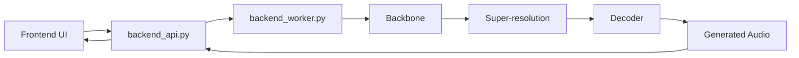

<div align="center">


# 基于统一声学词元路线的高保真歌曲生成系统

[English](./README.md) | 中文

</div>

<div align="center">


<a href="https://arxiv.org/abs/2605.01790">
  
</a>

<a href="https://huggingface.co/liujiafeng/Khala-MusicGeneration-v1.0">
  
</a>
<a href="./ENVIRONMENT_SETUP_zh.md">
  
</a>
<a href="./backend/README_backend_zh.md">
  
</a>

</div>

## ✨ Khala 是什么？

Khala 是一个面向高保真歌曲生成的开源系统，支持基于文本描述与歌词条件生成完整歌曲。与依赖语义 token、扩散模型或多级音频生成模块的路线不同，Khala 采用统一的声学词元建模路线，在同一套离散音频表示空间中完成从粗粒度音乐结构到细粒度声学细节的生成。

Khala 的核心特点包括：

- **完整歌曲生成**：面向歌曲级别的音乐生成，而不是短音频片段或伴奏循环。
- **文本与歌词控制**：支持通过自然语言 prompt 和 lyrics 控制风格、情绪、演唱与内容。
- **统一声学词元表示**：基于 64 层 RVQ acoustic token hierarchy，将音频表示为 coarse-to-fine 的离散声学词元。
- **两阶段生成链路**：首先由 backbone 生成粗粒度 acoustic tokens，再由 super-resolution 模型补全高层 RVQ tokens，最后通过 decoder 还原为 waveform。
- **完整系统实现**：提供前端界面、FastAPI 后端调度层、单卡推理 worker、模型加载与音频生成链路，而不是仅提供离散推理脚本。

## 📰 News

- `⚠️ [2026-05-07]` 我们发现了一个可能显著影响推理质量的问题，目前怀疑与数值精度有关。该问题正在排查和修复中，在此通知移除前，请谨慎看待当前版本的生成质量。

### ✅ 已更新

- `[2026-05-05]` arXiv 论文已上线：[Khala: Scaling Acoustic Token Language Models Toward High-Fidelity Music Generation](https://arxiv.org/abs/2605.01790)
- `[2026-05-01]` 代码、环境配置文档与 Dockerfile 已整理完成。

### ⏳ TODOs

- `[Coming Soon]` 对音乐人及小白友好的完整部署教程
- `[Coming Soon]` 多机多卡部署推理兼容性
- `[Coming Soon]` Discord 交流群

### 🖥️ 前端界面
#### Prompt 模式

#### Tag 模式


### 🎧 音频样例

音频样例页面正在制作中，将于近期上线。

## ✅ 运行要求

当前版本主要面向具备 GPU 服务器使用经验的研究人员与开发者。

- NVIDIA GPU，推荐 24GB 或以上显存用于完整推理链路（如 RTX 4090 或更高规格 GPU）
- Docker 与 NVIDIA Container Toolkit
- CUDA-compatible NVIDIA Driver
- Python / Node.js 环境已包含在预构建镜像中
- 模型权重需下载到仓库根目录的 `checkpoints/` 目录

## 🚀 快速开始

本节面向已经具备基本 Docker / CUDA 使用经验的研究人员与开发者，提供一条最短启动路径。

如果你想从干净的 NGC 容器一步步手动配置环境，请阅读：

- [ENVIRONMENT_SETUP_zh.md](./ENVIRONMENT_SETUP_zh.md)
- [ENVIRONMENT_SETUP.md](./ENVIRONMENT_SETUP.md)

如果你想了解后端结构与运行逻辑，请阅读：

- [backend/README_backend_zh.md](./backend/README_backend_zh.md)
- [backend/README_backend.md](./backend/README_backend.md)

### 1. 准备运行环境
当前可直接使用的预构建镜像：
```bash
docker pull ghcr.io/davidliujiafeng/khala-env:ngc25.02-node24

docker run --gpus all -it --rm \
  --name khala \
  -p 7869:7869 \
  -p 8889:8889 \
  ghcr.io/davidliujiafeng/khala-env:ngc25.02-node24
```
> 注意：上述命令使用 `--rm`，容器退出后容器内文件不会保留。若需要长期开发或保留下载好的模型权重，建议使用挂载目录或去掉 `--rm`。

### 2. 克隆仓库
进入容器后执行：
```bash
cd /workspace
git clone https://github.com/Khala-Music-AI/Khala.git
cd Khala
```

### 3. 下载模型权重

模型权重主页：

- [Hugging Face: liujiafeng/Khala-MusicGeneration-v1.0](https://huggingface.co/liujiafeng/Khala-MusicGeneration-v1.0)

在仓库根目录执行：

```bash
mkdir -p checkpoints
hf download liujiafeng/Khala-MusicGeneration-v1.0 --local-dir checkpoints
```

该命令会将模型仓库内容下载到本地 `checkpoints/` 目录。

### 4. 启动后端

```bash
cd /workspace/Khala/backend
bash run_backend.sh
```

### 5. 启动前端

在另一个终端中执行：

```bash
cd /workspace/Khala/frontend
npm install
npm run dev
```

### 6. 打开页面

默认访问地址：

- [http://127.0.0.1:7869](http://127.0.0.1:7869)

## 🧠 系统结构

当前系统由三层组成：

- 前端：负责输入 prompt、lyrics 和生成参数，并展示结果。
- API 调度层：负责接收请求、创建任务、排队并分发到空闲 worker。
- Worker 推理层：负责执行 backbone、super-resolution 和 decoder 推理。

请求链路如下：



## 🔗 相关资源

- Demo 页面：Coming Soon
- arXiv 论文：[Khala: Scaling Acoustic Token Language Models Toward High-Fidelity Music Generation](https://arxiv.org/abs/2605.01790)
- 模型权重：`https://huggingface.co/liujiafeng/Khala-MusicGeneration-v1.0`
- 环境配置：[ENVIRONMENT_SETUP_zh.md](./ENVIRONMENT_SETUP_zh.md)
- 后端说明：[backend/README_backend_zh.md](./backend/README_backend_zh.md)

## 🗂 仓库结构

```text
Khala/
├── backend/
├── frontend/
├── core/
├── models/
├── checkpoints/
├── assets/
├── Dockerfile
├── requirements.txt
├── ENVIRONMENT_SETUP.md
└── ENVIRONMENT_SETUP_zh.md
```

主要目录说明：

- `frontend/`：前端页面与 Vite 工程。
- `backend/`：后端 API、worker 和启动脚本。
- `core/`：项目自定义核心模块。
- `models/`：Megatron、decoder 和 tokenizer 相关代码。
- `checkpoints/`：模型权重文件目录。
- `assets/`：README 与展示页面使用的图片资源。


## 📚 引用方式

如果本项目对你的研究或开发有帮助，欢迎引用我们的论文：

- [Khala: Scaling Acoustic Token Language Models Toward High-Fidelity Music Generation](https://arxiv.org/abs/2605.01790)

正式 BibTeX 信息将在后续补充到论文页面与仓库文档中。

## 🙏 致谢

本项目当前实现建立在若干优秀开源项目与工具之上，包括但不限于：

- NVIDIA NGC
- Megatron / Megatron Core
- Hugging Face
- FastAPI
- Vite / React

## 📜 开源协议

当前模型权重计划采用 `CC BY-NC 4.0`（Creative Commons Attribution-NonCommercial 4.0 International）许可协议发布。

## 💬 Contact

欢迎扫码加入微信群交流项目进展、使用问题与后续更新：

<div align="center">
  
</div>
